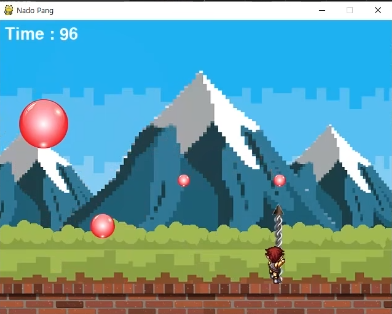
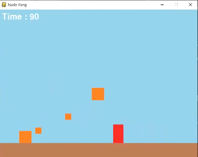

# 공 터뜨리기 게임

> 파이썬을 이용한 공을 터뜨리는

파이썬의 pygame 을 이용한 공 터뜨리기 게임

## 사용 예제

좌우 방향키를 사용하여 방향 조절.
스페이스키를 통해 무기를 발사.

## 정보

다음의 강의를 참고하여 만들었습니다.  
**https://www.youtube.com/watch?v=Dkx8Pl6QKW0&t=5021s**
